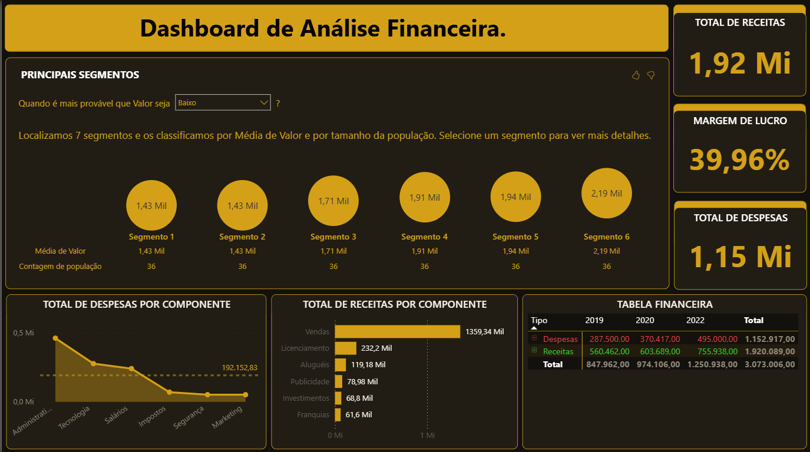

# 📊 Dashboard de Análise Financeira — Power BI

Dashboard financeiro com foco em receitas, despesas e margem de lucro — integrando análise de segmentação automática via IA (Key Influencers) para identificar os perfis de transação associados a valores mais baixos ou mais altos, com visão temporal de 2019 a 2022.

---

## 📸 Preview do Dashboard



## 🎯 Problema de negócio

Equipes financeiras frequentemente monitoram receita e despesa de forma separada, sem cruzar essas dimensões com os fatores que influenciam o valor das transações. Este dashboard centraliza os três indicadores-chave — total de receitas, total de despesas e margem de lucro — e adiciona uma camada analítica via IA para responder: quais segmentos de transação estão associados a valores mais baixos? Onde estão as maiores concentrações de despesa? E como receitas e despesas evoluíram ao longo dos anos?

---

## 🔍 Principais insights

- **Total de receitas de R$ 1,92 Mi contra R$ 1,15 Mi em despesas**, resultando em uma **margem de lucro de 39,96%** — indicador saudável, mas que requer monitoramento dado o crescimento das despesas ao longo do período.
- **Vendas dominam as receitas** com R$ 1,36 Mi (70,8% do total), muito acima das demais fontes — Licenciamento (R$ 232 Mil), Aluguéis (R$ 119 Mil) e Publicidade (R$ 78 Mil) compõem o restante.
- **Administração é o maior componente de despesa**, seguido de Tecnologia e Salários — Marketing é o menor componente, sugerindo uma estrutura de custos concentrada em operações internas.
- **O visual de Key Influencers identificou 7 segmentos** classificados por média de valor — com variação entre R$ 1,43 Mil (Segmentos 1 e 2) e R$ 2,19 Mil (Segmento 6), permitindo identificar quais perfis de transação puxam o valor para baixo.
- **Crescimento consistente de receitas e despesas entre 2019 e 2022** — receitas passaram de R$ 560 Mil para R$ 755 Mil (+34,8%), enquanto despesas foram de R$ 287 Mil para R$ 495 Mil (+72,5%), crescendo proporcionalmente mais rápido que as receitas — sinal de alerta para a margem futura.

---

## 📄 Estrutura do dashboard

O relatório é composto por uma única página com os seguintes visuais:

| Visual | Descrição |
|--------|-----------|
| **KPI — Total de Receitas** | Receita total acumulada no período (R$ 1,92 Mi) |
| **KPI — Margem de Lucro** | Percentual de margem calculado via medida DAX (39,96%) |
| **KPI — Total de Despesas** | Despesa total acumulada no período (R$ 1,15 Mi) |
| **Principais Segmentos (Key Influencers)** | Visual de IA nativo do Power BI — segmenta automaticamente as transações por média de valor e tamanho de população |
| **Total de Despesas por Componente** | Gráfico de linha/área com linha de referência na média (R$ 192 Mil) |
| **Total de Receitas por Componente** | Barras horizontais com ranking de fontes de receita |
| **Tabela Financeira** | Matriz com Despesas e Receitas por ano (2019, 2020, 2022) e total geral |

---

## 🛠️ Stack técnica

- **Ferramenta:** Power BI Desktop
- **Transformação de dados (Power Query):** ajuste de tipos de dado, promoção de cabeçalhos e configuração da fonte
- **Visualizações:** Key Influencers (visual de IA nativo do Power BI), matriz financeira com formatação condicional por tipo, gráfico de área com linha de referência e barras horizontais

**Medidas DAX criadas:**

As quatro medidas formam uma cadeia de dependência — as duas primeiras isolam receitas e despesas por tipo, e as duas seguintes calculam lucro e margem com base nelas:

```dax
TotalReceitas = CALCULATE(SUM(DadosFinanceiros[Valor]), DadosFinanceiros[Tipo] = "Receitas")
```

```dax
TotalDespesas = CALCULATE(SUM(DadosFinanceiros[Valor]), DadosFinanceiros[Tipo] = "Despesas")
```

Filtram a coluna `Valor` pelo campo `Tipo`, separando os dois fluxos financeiros a partir de uma única tabela de dados.

```dax
Lucro = [TotalReceitas] - [TotalDespesas]
```

Calcula o resultado líquido do período com base nas duas medidas anteriores.

```dax
MargemLucro = DIVIDE([Lucro], [TotalReceitas], 0)
```

Expressa a margem como proporção da receita total. O uso de `DIVIDE` com terceiro argumento `0` garante que divisões por zero retornem zero em vez de erro — evitando quebra nos visuais em períodos sem receita.

---

## 📊 Fonte dos dados

Dataset financeiro com cobertura de 2019 a 2022, originalmente utilizado em curso de formação em dados. O dashboard, os visuais, a formatação e a estrutura analítica foram desenvolvidos de forma independente — incluindo a escolha e configuração dos gráficos, uso do visual de IA, paleta, layout e cruzamentos exibidos.

---

## 🔗 Acesse o relatório

[Acesse o dashboard](https://app.powerbi.com/view?r=eyJrIjoiYjMzNjFhZTYtYjEzZi00NTI2LWI0ZWEtMDhlNmQzMjkzMGI5IiwidCI6ImIyZTE2Mjk3LTJlZDYtNDFiOC1iODIyLWE5NTRlOTViZDJmMCIsImMiOjR9)

---

## 📌 Limitações e próximos passos

- **O ano de 2021 não aparece na tabela financeira** — vale verificar se é ausência nos dados originais ou se foi filtrado durante o tratamento no Power Query.
- O visual de Key Influencers classifica os segmentos numericamente (Segmento 1 a 6), mas **não nomeia os fatores** que definem cada segmento sem interação — uma camada de texto explicativo no relatório tornaria esse insight mais acessível para quem acessa sem contexto.
- **Despesas cresceram 72,5% entre 2019 e 2022**, contra 34,8% das receitas — uma próxima iteração com projeção de margem para os próximos anos tornaria esse alerta acionável para planejamento financeiro.
